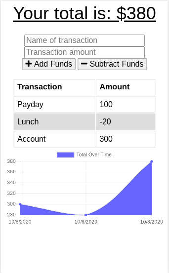

# Budget Tracker

## Links
[Github Repo](https://github.com/borielvi/budget-tracker)

[Deployed URL](https://web-budget-tracker.herokuapp.com/)

## Description
The budget tracker app is a website that allows users to keep track of their total money usage. It keeps track of users transactions even if they drop their internet connection.

